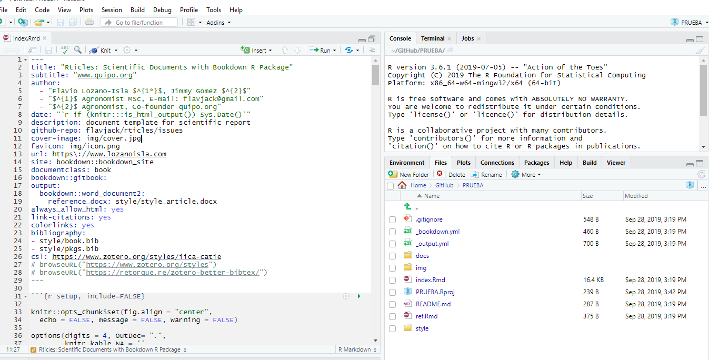

# Resumen del proyecto{-}

Los estudios de la dinámica de poblaciones de bivalvos necesitan un conocimiento del crecimiento y de la edad de los organismos dentro de la población (Ramón y Richardson,1992; citados en Jacabo 2018) por eso es importante la determinación de la edad de la Argopectun purpuratus. Para este propósito se utilizará la periodicidad en la formación de los microincrementos en las valvas como base. El experimento tratará de igualar su estado natural y por eso se cultivará a una densidad de 36 ejemplares/m² con tamaños aproximadamente de 60 mm (Fiestas et al., 2009).
Se plantea la hipótesis que la formación de microincrementos en las valvas de concha de abanico no muestra una periodicidad diaria. El experimento se realizará en la playa Atenas, bahía de paracas. Se cultivarán en un sistema de fondo tipo corrales. Se utilizarán tres jaulas de 1 m² con 36 individuos cada una. Antes del cultivo se hará un etiquetado de plástico con pegamento de cianocrilato para un control individual del recurso y se tomarán datos de talla. La marcación se hará con calceína y la primera se realizará a los 30 días sumergiendo las valvas durante 30 minutos a una concentración de 50 ppm. La segunda marcación se realizará a los 60 días y la tercera marcación se realizará a los 90 días. Finalizado el cultivo los ejemplares será llevados al laboratorio para el análisis de las valvas. Utilizaremos un microscopio de fluorescencia para poder medir las marcas dejadas por la calceina y así poder contabilizar los microincrementos desarrollados en los periodos de cultivo.

palabras claves  rgopectun purpuratus, Edad, Periodicidad, Valvas, Microcreciemiento,

## Propuesta de investigación in extenso{-}

Segun @repo-carrascoNutritionalValueUse2003:1 casi todos los trabajos sobre los estudios de microincrementos de pectínidos emplean un monitoreo de grupos en lugar de hacer una búsqueda al crecimiento individual a una escala de alta frecuencia (Thébault et al., 2008). En Perú hay pocos estudios sobre la periodicidad de la formación de microincrementos en las valvas. Es frecuente que la formación de microincrementos en las valvas de los bivalvos, ofrezcan un mecanismo para el monitoreo de alta frecuencia. Se ha estimado que la tasa de formación de microincrementos es diaria (Aguirre et al., 2015; Gosselin et al., 2013; Thébault et al., 2008; citado Jacabo 2018). Sin embargo, hay otros estudios que indica una formación de dos microincrementos por día. Por ejemplo, la investigación de Thébault (2006) sobre la formación de microincrementos en la vieira tropical Comptopallium rádula. Las valvas tienen un enorme potencial para el registro de las condiciones ambientales durante períodos que van desde meses hasta unos años y con una resolución de 2 días. Asimismo, hay otro estudio en el área marina protegida de La Rinconada en Chile. En este estudio se comprobó la formación de un microincremento cada dos días en individuos adultos de Argopectun purpuratus marcados con calceína y medidos durante 140 días (Thouzeau, 2015 comunicación personal con Aguirre; citado Jacabo 2018). La calceína se incorpora en las valvas y emite un[@navarroPhysiologicalResponsesChilean1998; @navarroPhysiologicalResponsesChilean1998:1]a fluorescencia verde la cual se utiliza como marcador para el estudio de su crecimiento (Kachler & McQuaid, 1999; citados en Jacabo 2018).

##  Justificación basada en la relevancia técnica y/o socioeconómica del tema propuesto 

El estudio de la concha de abanico es muy importante ya que es uno de los mayores recursos producidos en el Perú, con el estudio de la determinación de la edad de la concha de abanico se  podrá ayudar a saber más sobre su dinámica de población y así poder desarrollar un pesca sostenible del recursos. Los estudios también ayudarían indirectamente a productores de la concha de abanico del literal peruano porque así podrían gestionar mejor su recurso conociendo más sobre este , la formación de microincrementos es fundamental porque se puede hacer un monitoreo individual de alta frecuencia y además registra los cambios que este pueda tener en su medio ambiente.
Los estudios de la dinámica de poblaciones de bivalvos necesitan un conocimiento del crecimiento y de la edad de los organismos dentro de la población (Ramón y Richardson,1992; citados en Jacabo 2018) .La periodicidad en la formación de microincrementos en las valvas está relacionado con el término stock, ya que esto nos permite saber la unidad a conservar y qué cantidad de individuos podemos manejar. Los procesos que hacen aumentar o disminuir la dinámica del stock son el crecimiento, reclutamiento, mortalidades de pesca o de forma natural. Además, la edad es básica para entender la dinámica de poblaciones de especies explotadas y su evaluación de la población, proporcionando estimaciones de la tasa de crecimiento y la longevidad por especie y zona [@CostassosabrendarosarioPdf:1; @navarroPhysiologicalResponsesChilean1998:1; @R-base]. 


##   Objetivo de investigación:

General 
•	Determinar la periodicidad en la formación de microincrementos en las valvas como base para la determinación de la edad de la concha de abanico
Específicos 
●	Determinar el número de microincrementos que se forman en las valvas en un periodo de tiempo determinado
●	Analizar y validar la periodicidad de la formación de microincrementos

```{r fig.cap="figura 1 : atatatata" }

```


